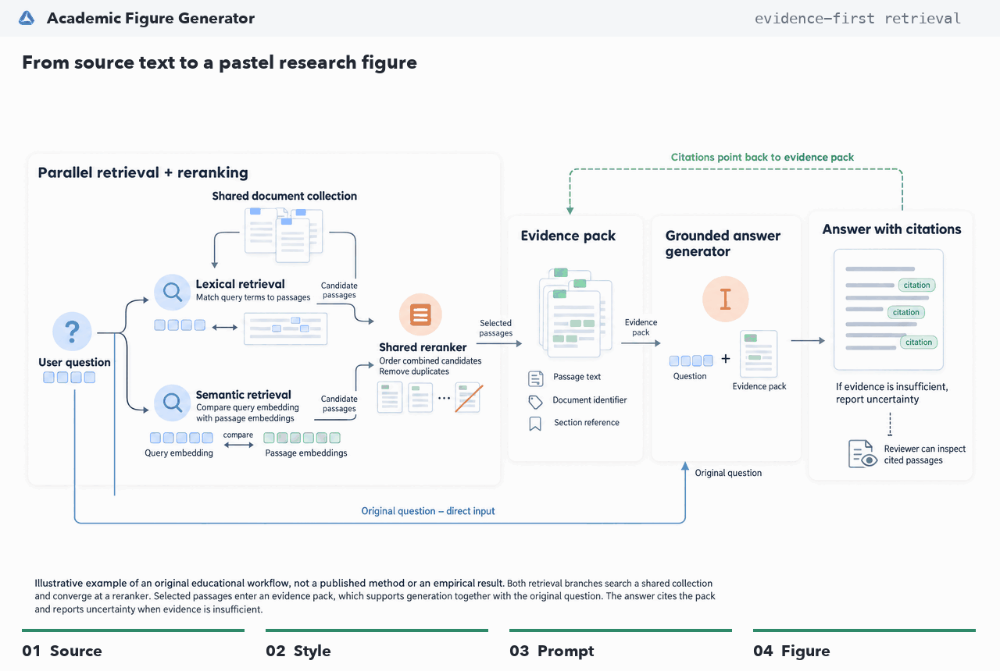

<p align="center"></p>
<h1 align="center">Academic Figure Generator</h1>
<p align="center"><strong>OpenAI Edition · Research Figure Workbench</strong></p>
<p align="center">From source passages to visual drafts and editable diagrams.</p>
<p align="center"><strong>English</strong> · <a href="./README.zh-CN.md">简体中文</a></p>
<p align="center">
  <a href="#see-it-in-action">See it in action</a> · <a href="#quick-start">Quick start</a> ·
  <a href="#workflow">Workflow</a> · <a href="#configuration">Configuration</a> ·
  <a href="#codex-skills">Codex skills</a>
</p>
<p align="center">
  <a href="https://github.com/amos689/Academic-Figure-Generator-OpenAI/actions/workflows/ci.yml"></a>
  
  
  <a href="./LICENSE"></a>
</p>

A local-first, bilingual workspace for research figures. Import a paper, choose its source sections, review an English drawing prompt, and generate or edit an image. For supported framework diagrams, inspect the source-linked **FigureSpec** and export real editable **SVG**, **draw.io**, or vector **PDF**.

## See It in Action

A short description of a retrieval workflow becomes a **3840 × 2160 pastel figure**: parallel retrieval, a shared reranker, an evidence pack, and an answer with citations.



1. **Describe the method.** Upload the example text and select Pastel, Quality, and the ML TopConf (Seaborn Deep) palette.
2. **Shape the drawing prompt.** `gpt-6-astra` with `max` reasoning produces a 13,245-character prompt and a source-linked FigureSpec.
3. **Generate the figure.** `gpt-image-2.5-sunburst` renders the reviewed prompt at maximum quality, 16:9, 4K.

[View the full-resolution PNG](./examples/showcase/retrieval/figure.png) · [Try the source text](./examples/showcase/retrieval/input.txt) · [Read the full prompt](./examples/showcase/retrieval/prompt.txt) · [Settings and usage](./examples/showcase/retrieval/manifest.json)

The [walkthrough](./examples/showcase/README.md) includes the complete Image API prompt and the FigureSpec. This run took **374.52 s** for the prompt and **73.45 s** for the image.

## Why This Workbench

| Need | What the application provides |
| --- | --- |
| Know what the model read | Explicit document/section selection, DOCX tables, balanced long-context excerpts, original section indices, and coverage metadata. |
| Control the composition | Classic/pastel styles, nine presets, custom palettes, quality/draft profiles, and an editable prompt before rendering. |
| Keep revisions connected | Prompt revision history, conflict detection, restore-as-new-revision, image ancestry, favorites, and selected outputs. |
| Survive long requests | SQLite-backed jobs, bounded concurrency, queued cancellation, explicit retries, and interrupted-job recovery. |
| Refine a figure | Uncropped preview, original-size inspection, side-by-side comparison, reference images, and drawn edit masks. |
| Deliver editable diagrams | Validated node/edge/group FigureSpec, source quotes, local SVG/PDF/draw.io rendering, and export history. |
| See actual configuration | Effective models, quality, credential source, per-generation timing and available token usage; no key is returned to the browser. |

The interface supports **English and Chinese**, with English as the default. No account, external database, Redis, or separate worker service is required.

## Quick Start

Requirements: **Python 3.12+**, **uv**, **Node.js 24 LTS with npm**, and an OpenAI API key with access to the configured models. The commands below target macOS/Linux. Install uv using its [official instructions](https://docs.astral.sh/uv/getting-started/installation/).

```bash
git clone https://github.com/amos689/Academic-Figure-Generator-OpenAI.git
cd Academic-Figure-Generator-OpenAI
```

### 1. Start the Backend

Set the key in the terminal that starts the backend. An already-exported system key is sufficient; there is no need to put it in the code.

```bash
export OPENAI_API_KEY="your-openai-api-key"
cd backend
uv sync --locked
uv run --locked uvicorn app.main:app --host 127.0.0.1 --port 8000
```

The first launch creates the SQLite schema and bundled palettes. Run **one web worker per database**. Development `--reload` is optional, but a reload interrupts running jobs; avoid it during billed generation.

### 2. Start the Frontend

In a second terminal at the repository root:

```bash
cd frontend
npm ci
npm run dev -- --host localhost --port 5173
```

Open **[localhost:5173](http://localhost:5173)**. The development server proxies `/api` to port 8000. API documentation is available at [localhost:8000/docs](http://localhost:8000/docs) when `DEBUG=true`.

<details>
<summary>PowerShell or pip-only installation</summary>

In PowerShell, use `$env:OPENAI_API_KEY = "your-openai-api-key"` before the same uv commands. A pip-based editable install is also supported, but resolves dependencies instead of using `uv.lock`:

```bash
python3 -m venv .venv
source .venv/bin/activate
python -m pip install -e .
uvicorn app.main:app --host 127.0.0.1 --port 8000
```

On Windows, activate with `.\.venv\Scripts\Activate.ps1` instead.
</details>

## Workflow

1. **Create a project and upload** PDF, DOCX, or TXT. Wait for the parse job to finish, then select the document.
2. **Choose evidence and style.** Use the entire document or selected sections; choose classic/pastel, palette, figure type, and quality/draft.
3. **Generate and review prompts.** Inspect sources, labels, relationships, and available FigureSpec. Save edits; stale revisions are not silently overwritten.
4. **Generate an image.** Choose aspect ratio and 1K/2K/4K size tier. Jobs remain visible while the provider works.
5. **Compare and refine.** Inspect the full image, favorite/select versions, or create an edit with a reference and optional mask. Every edit keeps its parent.
6. **Export a diagram.** In the FigureSpec tab, review the JSON and source quotes, save changes, then export SVG/PDF/draw.io. Existing prompts without a spec can request a separate paid derivation.

Use **Direct generation** when you already have a drawing prompt. Use the bundled **Codex skills** when you only need prompt text and do not want to run the application.

## Configuration

**Credential priority:** process environment → `backend/.env` → root `.env` → the empty placeholder in [config.py](./backend/app/config.py). Blank keys do not hide a populated lower-priority key. Real keys must never be committed.

| Setting | Default |
| --- | --- |
| `OPENAI_API_KEY` | Empty |
| `OPENAI_API_BASE` | `https://api.openai.com/v1` |
| `OPENAI_TEXT_MODEL` | `gpt-6-astra` |
| `OPENAI_TEXT_REASONING_EFFORT` | `max` |
| `OPENAI_TEXT_MAX_OUTPUT_TOKENS` | `32768` |
| `OPENAI_IMAGE_MODEL` | `gpt-image-2.5-sunburst` |
| `OPENAI_IMAGE_QUALITY` | `max` |
| `MAX_CONCURRENT_JOBS` | `2` |
| `MAX_UPLOAD_SIZE_MB` | `50` |

These are explicit defaults, not moving "latest" aliases. See the official [text-model](https://developers.openai.com/api/docs/models/gpt-6-astra) and [image-model](https://developers.openai.com/api/docs/models/gpt-image-2.5-sunburst) references. Existing environment overrides continue to win after upgrades. Restart the backend when settings change; **Settings** displays the effective values and offers an explicit, non-generative model-access check.

### Quality, Cost, and Size

- **Quality** uses the configured effort and quality, both `max` by default. **Draft** explicitly uses `medium` for both. Neither profile silently changes the selected models.
- The text output limit includes reasoning and final JSON. It is a budget, not a guarantee of quality or completion. Responses requests explicitly use Standard processing (`service_tier=default`).
- Image size defaults to **2K**. The tiers target pixel area, not a fixed width: 16:9 produces 1360×768, 2720×1536, or 3840×2160. The 4K tier is within the API limits but above the image guide's standard-size range; review large outputs carefully. See [size limits](https://developers.openai.com/api/docs/guides/image-generation#size-and-quality-options).
- Generation and editing consume your API balance. Reported tokens and duration are not an account-wide bill. Unknown usage remains unknown. Review [current pricing](https://developers.openai.com/api/docs/pricing) and your usage dashboard.
- Started requests are **never automatically resubmitted**. A network interruption may still have incurred a charge; inspect usage before retrying. Only queued jobs can be cancelled.

All optional settings are illustrated in [.env.example](./.env.example). Never place an API key in `VITE_*`: those variables are exposed to browsers.

## Privacy and Upgrades

Local-first is **not offline generation**. Parsing, vector export, and fixture evaluation are local. Requested prompt/image operations send selected source excerpts, prompts, and any reference/mask images to the configured OpenAI endpoint.

| Local artifact | Default location |
| --- | --- |
| Projects, revisions, jobs, provenance | `backend/data/app.db` |
| Documents, references, masks | `backend/data/uploads/` |
| Raster images | `backend/data/figures/` |
| Vector exports | `backend/data/exports/` |
| Pre-migration database backups | `backend/data/migration-backups/` |

`.env`, data directories, virtual environments, and local runtime files are ignored. If you override `DATA_DIR` or `DATABASE_PATH`, keep those locations outside version control too. Exports may include source quotes in SVG/draw.io metadata or PDF attachments; review them before sharing.

**Single-user, localhost only.** There is no authentication or tenant isolation. Host/origin checks are not a substitute for access control. Do not publish the development server through a public tunnel or expose it on a LAN.

To upgrade: stop generation, back up local data, pull the code, run `uv sync --locked` in `backend/` and `npm ci` in `frontend/`, then restart. Alembic preserves existing records and creates a SQLite backup before an unapplied migration. Previously running jobs become **interrupted**, not silently re-run.

## Codex Skills

The [general skill](./academic-figure-prompt/SKILL.md) and [pastel skill](./academic-figure-prompt-pastel/SKILL.md) work independently of the backend. Install them from the repository root:

```bash
mkdir -p "${CODEX_HOME:-$HOME/.codex}/skills"
cp -R academic-figure-prompt "${CODEX_HOME:-$HOME/.codex}/skills/"
cp -R academic-figure-prompt-pastel "${CODEX_HOME:-$HOME/.codex}/skills/"
```

Then ask Codex:

```text
Read this paper and generate a detailed academic figure prompt.
pastel风格论文配图
modern ML figure prompt
```

Skill-only use produces prompt text in the agent. It does not start this server or automatically call its image API. The backend reuses these skills as template material without depending on a Claude runtime.

## Limits Worth Knowing

- Scanned/image-only papers need external OCR first. PDF extraction is heuristic; DOCX retains ordered paragraphs and tables, not page-perfect layout.
- Source-quote checks establish that a quote exists in supplied text, **not that it logically supports every claim**. Review generated labels, arrows, notation, and numeric content.
- FigureSpec supports bounded node/edge/group diagrams. It is not arbitrary raster-to-vector conversion, a freeform graphical editor, or an editable reconstruction of every illustration.
- Masks guide the image model and can affect unmasked regions. Image outputs may still contain routing or text errors, including at maximum settings.
- This release does not provide public multi-user hosting, distributed workers, PPTX export, or automatic aesthetic scoring.

## Development

```bash
# backend/
uv sync --locked --extra dev
uv run --locked pytest -q
uv run --locked ruff check app tests

# frontend/
npm ci
npm test
npm run lint
npm run build
```

CI runs these offline checks without API credentials. [Fixed evaluation fixtures](./examples/evaluation/README.md) test structure, quotes, and allowed numeric wording; they do not claim to measure aesthetic or general scientific quality.

Implementation map: [backend](./backend/README.md) · [frontend](./frontend/README.md) · [API contract](./docs/workbench-api-contract.md) · [technical design](./docs/phase2-technical-design.md) · [upgrade roadmap](./docs/implementation-roadmap.md).

| Symptom | Next step |
| --- | --- |
| Missing key/model access | Check effective Settings and its access check; export the key in the backend terminal and restart. |
| Prompt exceeds output budget | Request fewer figures, increase the token budget, or select Draft. |
| Job failed/interrupted | Inspect the job error and provider usage before an explicit retry. |
| Stale prompt revision | Compare the saved version with your retained draft, then load it or rebase your draft. |
| Frontend cannot connect | Check port 8000; for another API, set `VITE_API_BASE_URL` and allow its frontend origin in `CORS_ORIGINS`. |
| Vector export unavailable | Supply/review a valid FigureSpec; an image alone is not an editable graph. |

## Acknowledgements

This project is developed from [LigphiDonk/academic-figure-generator](https://github.com/LigphiDonk/academic-figure-generator). We thank the original author for all contributions to the project's design, implementation, and open-source release.

## License

[MIT](./LICENSE).
