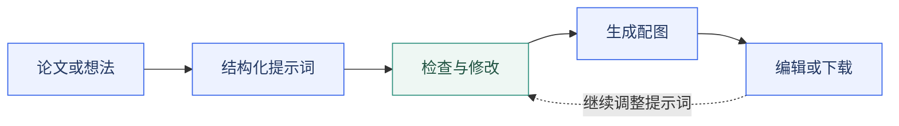

<p align="center">
  
</p>

<h1 align="center">Academic Figure Generator</h1>

<p align="center"><strong>OpenAI Edition · 学术配图工作台</strong></p>
<p align="center">把研究内容转化为配图，让每一步构图都有可编辑的提示词。</p>

<p align="center">
  <a href="./README.md">English</a> · <strong>简体中文</strong>
</p>

<p align="center">
  <a href="#quick-start">快速开始</a> ·
  <a href="#workflow">工作流程</a> ·
  <a href="#configuration">配置说明</a> ·
  <a href="#codex-skills">Codex 技能</a>
</p>

<p align="center">
  
  
  
  <a href="./LICENSE"></a>
</p>

一个在本地运行的学术配图工作台。上传 PDF、DOCX 或 TXT 论文，生成结构化配图提示词，调整构图，再通过 OpenAI 生成与编辑图片。

提示词本身也是项目成果：在生成图片之前，你可以查看并修改模型即将绘制的内容，而不必把整个过程交给一次不可见的调用。

<a id="workflow"></a>

## 工作流程



**读论文，改提示词，审配图。** 每个阶段都能在项目工作区中查看和处理。

### 选择适合你的入口

| 模式 | 从什么开始 | 适用场景 |
| --- | --- | --- |
| **论文工作区** | PDF、DOCX 或 TXT 论文 | 根据指定章节生成提示词，并统一管理文档、提示词和配图。 |
| **快捷生成** | 已经写好的图片提示词 | 构图需求已经明确，希望直接生成图片。 |
| **Codex 技能** | 编程助手中的论文或研究描述 | 只需要详细配图提示词，不必运行完整网页应用。 |

### 当前能做什么

| 能力 | 当前实现 |
| --- | --- |
| 结合论文构图 | 解析文档、选择章节、生成整体框架或章节配图，并补充自己的要求。 |
| 编辑提示词 | 查看生成的英文提示词，在生图前保存修改。 |
| 控制视觉方向 | 内置 9 套配色预设、自定义配色管理、画幅选择，以及 pastel 等风格请求。 |
| 生成配图 | 调用 OpenAI 生成和编辑图片；项目工作区支持按像素面积计算的 1K、2K、4K 档位。 |
| 持续修改 | 对已有图片提交改图指令，预览结果并下载。 |
| 结构底稿 | 模板模式请求生成无文字标签的基础结构，便于后续标注。 |
| 本地管理 | SQLite 保存项目记录，本地文件保存上传内容与图片，界面自动更新生成状态。 |

当前网页界面主要使用中文。项目文档提供中英文两个版本，仓库默认展示英文版。

<a id="quick-start"></a>

## 快速开始

### 环境要求

- Python **3.12+**。
- Node.js **22.12+** 与 npm。
- 可访问所配置文本模型和图像模型的 OpenAI API key。

以下命令适用于 macOS 和 Linux。无需额外部署数据库、Redis 或任务工作进程。

### 1. 获取项目

```bash
git clone https://github.com/amos689/Academic-Figure-Generator-OpenAI.git
cd Academic-Figure-Generator-OpenAI
```

### 2. 启动后端

在启动后端的同一个终端中配置密钥。下面的值仅为占位示例。

```bash
export OPENAI_API_KEY="your-openai-api-key"

cd backend
python3 -m venv .venv
source .venv/bin/activate
python -m pip install -e .
uvicorn app.main:app --host 127.0.0.1 --port 8000 --reload
```

首次运行时，后端会自动创建本地 SQLite 数据库并加载内置配色。

### 3. 启动前端

另开一个终端，进入项目根目录后运行：

```bash
cd frontend
npm ci
npm run dev -- --host localhost --port 5173
```

打开 **[localhost:5173](http://localhost:5173)**。交互式 API 文档位于 **[localhost:8000/docs](http://localhost:8000/docs)**。

<details>
<summary>Windows / PowerShell</summary>

在项目根目录执行以下命令启动后端：

```powershell
$env:OPENAI_API_KEY = "your-openai-api-key"
cd backend
py -3.12 -m venv .venv
.\.venv\Scripts\Activate.ps1
python -m pip install -e .
uvicorn app.main:app --host 127.0.0.1 --port 8000 --reload
```

在另一个终端运行相同的前端命令。如果安装了更高版本的 Python，创建虚拟环境时选择对应解释器即可。

</details>

### 生成第一张配图

1. 创建项目并上传论文。
2. 选择整体框架或指定章节，描述希望生成的配图。
3. 生成提示词，检查科研内容、文字标签、布局和配色。
4. 修改提示词，选择画幅与尺寸档位，再生成图片。
5. 查看结果，按需提交改图指令，最后下载 PNG。

不依赖论文的场景可以直接打开**快捷生成**。想要 pastel 风格时，可以加入这样的要求：

> 使用现代 ML 论文风格：纯白画布、柔和的 pastel 面板、清晰的箭头和易读的标签。严格保留方法中实际存在的模块及其关系。

<a id="configuration"></a>

## 配置说明

默认的文本和图片调用均使用 OpenAI，不需要额外配置 Anthropic 或 NanoBanana 密钥。

| 配置项 | 默认值 | 用途 |
| --- | --- | --- |
| `OPENAI_API_KEY` | 空字符串 | 后端生成提示词和图片时必需。 |
| `OPENAI_API_BASE` | `https://api.openai.com/v1` | API 地址。 |
| `OPENAI_TEXT_MODEL` | `gpt-6-astra` | 通过 Responses API 生成结构化配图提示词。 |
| `OPENAI_TEXT_REASONING_EFFORT` | `max` | 文本推理强度。 |
| `OPENAI_TEXT_MAX_OUTPUT_TOKENS` | `32768` | 推理过程与最终提示词输出共享的 token 预算。 |
| `OPENAI_IMAGE_MODEL` | `gpt-image-2.5-sunburst` | 通过 Images API 生成和编辑图片。 |
| `OPENAI_IMAGE_QUALITY` | `max` | 图片生成质量。 |

这些是项目明确指定的默认值，不会自动跳转到未来发布的新模型。模型能力请参考官方 [GPT-6 Astra](https://developers.openai.com/api/docs/models/gpt-6-astra) 与 [GPT Image 2.5 Sunburst](https://developers.openai.com/api/docs/models/gpt-image-2.5-sunburst) 文档。

**配置读取顺序：** 系统环境变量 → `backend/.env` → 根目录 `.env` → [config.py](./backend/app/config.py) 中的默认值。两个本地文件同时存在时，`backend/.env` 优先。

需要文件配置时，可参考 [.env.example](./.env.example)。真实密钥应保留在版本控制之外。修改后需重启后端；设置页展示配置说明和默认值，不是可实时保存配置的编辑器。

### 质量与尺寸

默认配置优先考虑质量。较高的推理强度和图片质量可能增加耗时与用量；制作初稿时，可以将 `max` 调整为 `high`。

项目工作区默认使用 **2K**。1K / 2K / 4K 表示目标像素面积档位，实际宽高取决于画幅。尺寸会取整为 16 的倍数，最长边不超过 3840 像素，总面积不超过 8,294,400 像素。更大尺寸还需遵循图像模型的[官方限制](https://developers.openai.com/api/docs/guides/image-generation#size-and-quality-options)。

### 升级已有安装

拉取更新后，激活后端虚拟环境，重新执行 `python -m pip install -e .`。前端依赖发生变化时，在 `frontend/` 中执行 `npm ci`。

原有环境变量和 `.env` 仍会覆盖新的代码默认值。请更新或删除旧模型配置，再重启后端。切换模型时，也要选择它支持的推理强度与质量参数；例如 GPT Image 2 的质量档位最高为 `high`。

## 数据与隐私

**数据本地保存，不代表生成过程离线。** 项目记录、上传文档、提示词和生成图片保存在你的电脑上。生成提示词时，后端会将所选章节的提取文本与要求发送给 OpenAI；生成或编辑图片时，会发送提示词以及使用到的参考图片。

| 数据 | 默认位置 |
| --- | --- |
| 项目与生成记录 | `backend/data/app.db` |
| 上传的文档 | `backend/data/uploads/` |
| 生成的图片 | `backend/data/figures/` |

仓库已忽略本地 `.env`、`backend/data/`、虚拟环境和 Agent 会话记录。可以通过 `DATA_DIR` 与 `DATABASE_PATH` 修改保存位置；自定义的数据目录也应排除在版本控制之外。

本项目面向单用户本地使用，没有身份认证。快速开始中的命令将后端绑定到本机地址。

<a id="codex-skills"></a>

## Codex 技能

只需要配图提示词时，可以直接使用随仓库提供的技能，无需安装网页应用。

| 技能 | 侧重点 |
| --- | --- |
| [Academic Figure Prompt](./academic-figure-prompt/SKILL.md) | 生成框架图、网络架构图、模块图、对比图与数据模式图的详细英文提示词。 |
| [Modern ML / Pastel](./academic-figure-prompt-pastel/SKILL.md) | 纯白画布、柔和 pastel 点缀、紧凑分区和现代 ML 论文构图。 |

在项目根目录执行：

```bash
mkdir -p ~/.codex/skills
cp -R academic-figure-prompt ~/.codex/skills/
cp -R academic-figure-prompt-pastel ~/.codex/skills/
```

如果设置了自定义 `CODEX_HOME`，请改用其中的 `skills/` 目录。然后向 Codex 提出请求，例如：

```text
帮我阅读这篇论文，生成详细的论文配图提示词。
modern ML figure prompt
pastel风格论文配图
```

技能模式在编程助手中生成提示词文本，不会启动后端，也不会自动调用本项目的图片 API。

## 技术结构

| 层级 | 技术 |
| --- | --- |
| 前端 | React 19、TypeScript、Vite、Tailwind CSS、Radix UI |
| 后端 | FastAPI、Pydantic Settings、SQLAlchemy |
| 持久化 | SQLite 与本地文件 |
| 文档解析 | PyMuPDF、python-docx、纯文本解析 |
| 提示词生成 | OpenAI Responses API 与严格 JSON schema |
| 图片生成 | OpenAI Images API、后台任务与状态接口 |

提示词生成采用同步 HTTP 请求，图片生成采用后端后台任务。网页通过轮询更新状态；后端也提供 SSE 接口供 API 客户端使用。

```text
Academic-Figure-Generator-OpenAI/
  backend/app/api/v1/           HTTP 接口
  backend/app/services/        文档、提示词与图片服务
  backend/app/config.py        模型与应用默认配置
  backend/tests/               配置与 API 契约测试
  frontend/src/pages/          项目、生成、配色和设置页面
  academic-figure-prompt/      通用学术配图提示词技能
  academic-figure-prompt-pastel/  现代 ML / pastel 技能
  README.md                    英文文档
  README.zh-CN.md               中文文档
```

## 开发与贡献

在 `backend/` 目录激活虚拟环境后运行：

```bash
python -m pip install -e ".[dev]"
pytest -q
```

在 `frontend/` 目录构建前端：

```bash
npm run build
```

实现入口见[后端说明](./backend/README.md)和[前端说明](./frontend/README.md)。可以通过 [Issue](https://github.com/amos689/Academic-Figure-Generator-OpenAI/issues) 说明希望改进的使用流程，或提交范围明确、附带相关验证的 Pull Request。

## 常见问题

| 现象 | 排查方式 |
| --- | --- |
| 提示缺少 API key | 在启动后端的终端中导出密钥，或设置本地 `.env`，然后重启。 |
| 模型不可用 | 检查当前 OpenAI 账户与 API 地址是否支持指定模型。升级后，显式填写的旧配置仍然生效。 |
| 提示词生成耗尽 token 预算 | 提高 `OPENAI_TEXT_MAX_OUTPUT_TOKENS`、减少本次配图数量，或降低推理强度。 |
| PDF 无法提取足够文本 | 使用带文本层的 PDF，或先在外部执行 OCR，再上传 TXT。默认解析器不会对扫描页执行 OCR。 |
| 前端无法连接后端 | 检查 8000 端口；更换地址时，在 `frontend/.env` 中设置 `VITE_API_BASE_URL`，并在 `CORS_ORIGINS` 中允许前端来源。 |
| 图中的标签或关系有误 | 修改提示词或提交改图指令，并检查新结果。 |

生成结果是栅格图片草稿。用于论文前，请核对科学关系、符号和数值；本项目目前不导出可编辑的矢量图。

## 致谢

本项目基于原项目 [LigphiDonk/academic-figure-generator](https://github.com/LigphiDonk/academic-figure-generator) 继续开发。感谢原作者在项目设计、代码实现与开源工作中的所有贡献。

## 许可证

[MIT](./LICENSE)。
