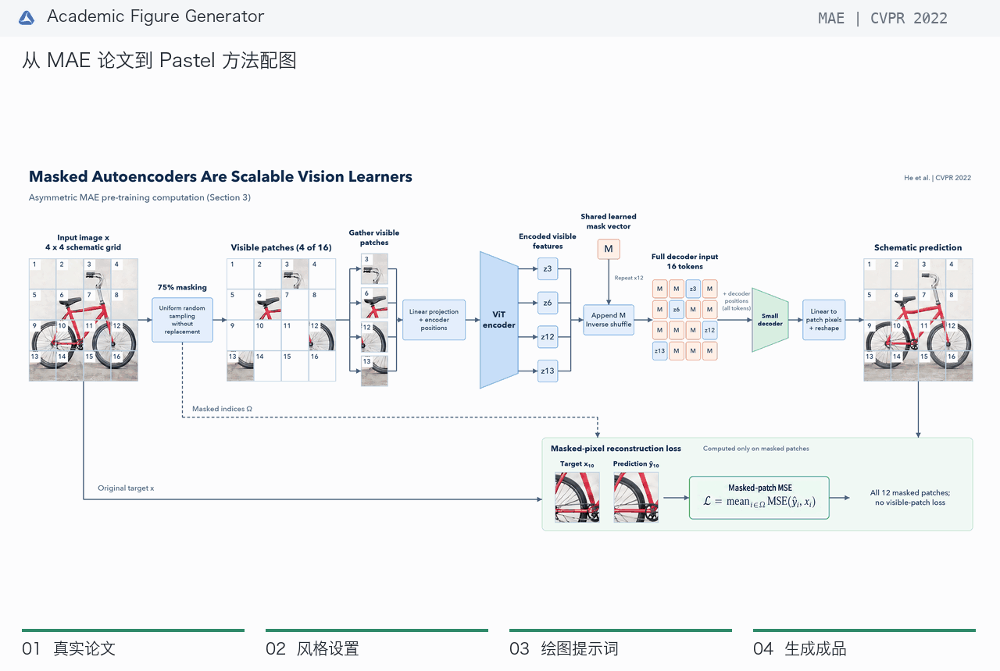

<p align="center"></p>
<h1 align="center">Academic Figure Generator</h1>
<p align="center"><strong>OpenAI Edition · 科研配图工作台</strong></p>
<p align="center">从论文原文，到图像草稿，再到可编辑的结构图。</p>
<p align="center"><a href="./README.md">English</a> · <strong>简体中文</strong></p>
<p align="center">
  <a href="#看看生成过程">看看生成过程</a> · <a href="#快速开始">快速开始</a> ·
  <a href="#使用流程">使用流程</a> · <a href="#配置">配置</a> ·
  <a href="#codex-skills">Codex Skills</a>
</p>
<p align="center">
  <a href="https://github.com/amos689/Academic-Figure-Generator-OpenAI/actions/workflows/ci.yml"></a>
  
  
  <a href="./LICENSE"></a>
</p>

一个本地优先、中英双语的科研配图工作台。上传论文、选择章节，先审阅英文绘图提示词，再生成或编辑图像。对于框架图和流程图，还可以检查带原文引用的 **FigureSpec**，导出真正可编辑的 **SVG、draw.io** 和矢量 **PDF**。

## 看看生成过程

从一篇正式发表的论文，制作一张 **4800 × 1920 的 Pastel 方法图**。本例读取 [He 等人在 CVPR 2022 发表的 Masked Autoencoders Are Scalable Vision Learners](https://openaccess.thecvf.com/content/CVPR2022/html/He_Masked_Autoencoders_Are_Scalable_Vision_Learners_CVPR_2022_paper.html) 第 3 节，展现其非对称编码器与解码器：75% 遮挡、仅编码可见块、加入遮挡标记，以及只在缺失区域计算重建损失。



1. **读取论文。** 上传官方 PDF，选择 **3. Approach**，使用 Pastel 风格、Quality 档位和 ML TopConf (Seaborn Deep) 配色。
2. **细化绘图提示词。** `gpt-6-astra` 使用 `max` 推理，将方法转化为具体的图像块、带标记的特征，以及明确的监督路径。
3. **生成成品。** `gpt-image-2.5-sunburst` 根据审阅后的提示词，以最高画质、16:9、4K 输出图片。
4. **调整排版。** 本例的[本地构图脚本](./docs/demo/layout_mae.py)将素材排入更宽的 5:2 画布，对齐模块并精确连接端点。

[查看高清 PNG](./examples/showcase/mae/figure.png) · [阅读原论文](https://openaccess.thecvf.com/content/CVPR2022/papers/He_Masked_Autoencoders_Are_Scalable_Vision_Learners_CVPR_2022_paper.pdf) · [阅读完整提示词](./examples/showcase/mae/prompt.txt) · [参数与用量](./examples/showcase/mae/manifest.json)

[案例说明](./examples/showcase/README.zh-CN.md)提供实际生成请求、两阶段提示词、方法概要和语义结构。同一张自行车图像贯穿整个过程，让图像块本身解释计算，而不是用通用图标代替内容。

## 工作台能力

| 需求 | 当前实现 |
| --- | --- |
| 知道模型读取了什么 | 明确选择文档和章节，保留 DOCX 表格、原始章节索引，均衡截取长文档，并记录上下文覆盖率。 |
| 控制构图方向 | Classic/Pastel 风格、九组预设、自定义配色、质量/草稿档位，以及生图前可编辑的提示词。 |
| 管理多轮修改 | 提示词修订历史、冲突检测、恢复为新修订、图片父子关系、收藏和最终选用。 |
| 处理耗时生成 | SQLite 持久化任务、并发限制、排队取消、显式重试和中断恢复。 |
| 精修图片 | 不裁切预览、原尺寸查看、双图对比、参考图和手绘编辑蒙版。 |
| 交付可编辑图形 | 校验节点、连接、分组和原文引用；本地渲染 SVG/PDF/draw.io，保留导出历史。 |
| 查看真实配置 | 生效模型、质量、密钥来源，以及单次生成的耗时和可用 Token 用量；浏览器不会收到密钥。 |

界面支持 **English / 中文**切换，默认英文。无需注册账号、外部数据库、Redis 或独立队列服务。

## 快速开始

需要 **Python 3.12+、uv、Node.js 24 LTS（含 npm）**，以及有权限访问所选模型的 OpenAI API key。以下命令适用于 macOS/Linux；uv 安装方法见[官方文档](https://docs.astral.sh/uv/getting-started/installation/)。

```bash
git clone https://github.com/amos689/Academic-Figure-Generator-OpenAI.git
cd Academic-Figure-Generator-OpenAI
```

### 1. 启动后端

在启动后端的同一个终端中设置密钥。如果系统环境变量已经配置，无需在代码中再次填写。

```bash
export OPENAI_API_KEY="your-openai-api-key"
cd backend
uv sync --locked
uv run --locked uvicorn app.main:app --host 127.0.0.1 --port 8000
```

首次启动会建立数据库并初始化预设配色。**同一个数据库只运行一个 Web worker。** 开发时可以加 `--reload`，但重载会中断正在执行的任务，付费生成期间请勿使用。

### 2. 启动前端

另开一个终端，在仓库根目录执行：

```bash
cd frontend
npm ci
npm run dev -- --host localhost --port 5173
```

访问 **[localhost:5173](http://localhost:5173)**。开发服务器将 `/api` 代理到 8000 端口。`DEBUG=true` 时可访问 [API 文档](http://localhost:8000/docs)。

<details>
<summary>PowerShell 或仅使用 pip 安装</summary>

PowerShell 中先执行 `$env:OPENAI_API_KEY = "your-openai-api-key"`，然后使用相同的 uv 命令。也支持 pip 可编辑安装，但它会重新解析依赖，不使用 `uv.lock`：

```bash
python3 -m venv .venv
source .venv/bin/activate
python -m pip install -e .
uvicorn app.main:app --host 127.0.0.1 --port 8000
```

Windows 激活虚拟环境时改用 `.\.venv\Scripts\Activate.ps1`。
</details>

## 使用流程

1. **新建项目并上传** PDF、DOCX 或 TXT。解析完成后，明确选择要使用的文档。
2. **选择证据与风格。** 使用全文或指定章节，选择 Classic/Pastel、配色、图类型及质量/草稿档位。
3. **生成并审阅提示词。** 检查来源、标签、关系和可用的 FigureSpec。保存修改；过期版本不会静默覆盖新版本。
4. **生成图片。** 选择比例和 1K/2K/4K 尺寸档位，通过任务列表跟踪生成状态。
5. **比较并精修。** 查看完整图片，收藏或选用版本，也可以添加参考图和蒙版创建编辑版本；系统保留父图关系。
6. **导出结构图。** 在 FigureSpec 页审阅 JSON 和原文引用，保存后导出 SVG/PDF/draw.io。旧提示词没有结构时，可以单独发起一次付费结构推导。

已有绘图提示词时使用**直接生成**；只需要提示词、不想运行 Web 应用时使用 **Codex Skills**。

## 配置

**密钥读取顺序：** 系统进程环境变量 → `backend/.env` → 仓库根目录 `.env` → [config.py](./backend/app/config.py) 的空字符串占位。空白密钥不会遮蔽低优先级中已填写的密钥。不要提交任何真实密钥。

| 配置项 | 默认值 |
| --- | --- |
| `OPENAI_API_KEY` | 空 |
| `OPENAI_API_BASE` | `https://api.openai.com/v1` |
| `OPENAI_TEXT_MODEL` | `gpt-6-astra` |
| `OPENAI_TEXT_REASONING_EFFORT` | `max` |
| `OPENAI_TEXT_MAX_OUTPUT_TOKENS` | `32768` |
| `OPENAI_IMAGE_MODEL` | `gpt-image-2.5-sunburst` |
| `OPENAI_IMAGE_QUALITY` | `max` |
| `MAX_CONCURRENT_JOBS` | `2` |
| `MAX_UPLOAD_SIZE_MB` | `50` |

这些是明确的项目默认值，不是自动追踪未来版本的“latest”别名。模型能力见官方[文本模型](https://developers.openai.com/api/docs/models/gpt-6-astra)和[图像模型](https://developers.openai.com/api/docs/models/gpt-image-2.5-sunburst)说明。升级后原有环境变量仍优先，修改设置后请重启后端。**设置**页面展示真实生效值，并提供不生成内容的模型访问检查。

### 质量、费用与尺寸

- **高质量**采用配置中的 effort 与 quality，默认均为 `max`；**草稿**将两者明确设为 `medium`，不会静默更换模型。
- 文本输出上限同时包含推理 Token 和最终 JSON，只是预算，不代表效果或完成保证。Responses 请求明确使用标准处理档 `service_tier=default`。
- 默认图片尺寸为 **2K**。档位按目标像素面积计算，而非固定宽度：16:9 对应 1360×768、2720×1536 或 3840×2160。4K 在 API 限制内，但高于图像文档的标准尺寸范围，需认真检查大尺寸结果。参见[尺寸限制](https://developers.openai.com/api/docs/guides/image-generation#size-and-quality-options)。
- 生成和编辑会使用你的 API 余额。记录的 Token 与耗时不等于账号账单，缺失用量不会被当成零。费用以[最新价格](https://developers.openai.com/api/docs/pricing)和账号用量页面为准。
- 已开始的请求**不会自动重新提交**。网络中断不代表没有扣费，重试前应检查用量；仅排队中的任务可以取消。

其他配置参见 [.env.example](./.env.example)。不要在 `VITE_*` 变量中存放密钥，这些值会暴露给浏览器。

## 隐私与升级

本地优先**不等于离线生成**。文档解析、矢量导出和固定样例评估在本地完成；用户请求生成时，选中的原文片段、提示词及参考图/蒙版会发送到配置的 OpenAI 接口。

| 本地内容 | 默认位置 |
| --- | --- |
| 项目、修订、任务和生成记录 | `backend/data/app.db` |
| 文档、参考图和蒙版 | `backend/data/uploads/` |
| 生成图片 | `backend/data/figures/` |
| 矢量导出 | `backend/data/exports/` |
| 数据库迁移前备份 | `backend/data/migration-backups/` |

仓库忽略 `.env`、数据目录、虚拟环境和本地运行文件。若修改 `DATA_DIR` 或 `DATABASE_PATH`，也应将新位置排除在版本控制之外。SVG/draw.io 元数据和 PDF 附件可能包含来源引用，公开文件前请审阅。

**仅用于单用户本地运行。** 没有用户认证或租户隔离，Host/Origin 检查不是访问控制。不要通过公开隧道或局域网暴露开发服务器。

升级步骤：停止生成、备份本地数据、拉取代码，在 `backend/` 执行 `uv sync --locked`，在 `frontend/` 执行 `npm ci`，然后重启。Alembic 保留已有记录，并在执行未应用的迁移前创建 SQLite 备份。之前正在运行的任务会标记为**中断**，不会自动重新计费生成。

## Codex Skills

[通用配图 Skill](./academic-figure-prompt/SKILL.md) 和 [Pastel Skill](./academic-figure-prompt-pastel/SKILL.md) 可独立于后端使用。在仓库根目录安装：

```bash
mkdir -p "${CODEX_HOME:-$HOME/.codex}/skills"
cp -R academic-figure-prompt "${CODEX_HOME:-$HOME/.codex}/skills/"
cp -R academic-figure-prompt-pastel "${CODEX_HOME:-$HOME/.codex}/skills/"
```

然后在 Codex 中输入：

```text
帮我阅读这篇论文，生成论文配图提示词。
pastel风格论文配图
modern ML figure prompt
```

轻量模式只在 Agent 中生成提示词，不启动后端，也不会自动调用本项目的图像 API。后端把 Skill 作为模板参考，不依赖 Claude 运行时。

## 能力边界

- 扫描版或纯图片论文需先通过外部 OCR 转成文本。PDF 采用启发式提取；DOCX 保留段落和表格顺序，不保证页面布局还原。
- 原文引用校验能确认片段存在，**不能证明它在逻辑上支持所有结论**。发布前请核对标签、箭头、符号和数字。
- FigureSpec 面向有界的节点、连接、分组图，不是任意图片矢量化、自由绘图画布，也不是所有插画的可编辑重建。
- 蒙版只是模型的编辑指引。即便最高设置，图片仍可能存在连线或文字问题，未标记区域也可能变化。
- 当前不提供公网多用户部署、分布式 Worker、PPTX 导出或自动美学评分。

## 开发验证

```bash
# backend/
uv sync --locked --extra dev
uv run --locked pytest -q
uv run --locked ruff check app tests

# frontend/
npm ci
npm test
npm run lint
npm run build
```

CI 在不提供 API 密钥的情况下运行离线检查。[固定评估样例](./examples/evaluation/README.md)验证结构、原文引用和允许的数字表述，不把它们包装成美学或通用科研质量评分。

实现入口：[后端](./backend/README.md) · [前端](./frontend/README.md) · [API 合约](./docs/workbench-api-contract.md) · [技术设计](./docs/phase2-technical-design.md) · [升级路线](./docs/implementation-roadmap.md)。

| 问题 | 排查方式 |
| --- | --- |
| 密钥缺失或模型无权限 | 查看设置页和访问检查，在启动后端的终端配置密钥后重启。 |
| 提示词超过输出预算 | 减少图数量、提高 Token 上限，或选择草稿档位。 |
| 任务失败或中断 | 查看错误和服务方用量，确认后再显式重试。 |
| 提示词版本冲突 | 对比服务器版本与保留的草稿，再载入或基于新版本继续修改。 |
| 前端无法连接 | 检查 8000 端口；使用其他地址时设置 `VITE_API_BASE_URL`，并在 `CORS_ORIGINS` 中允许前端来源。 |
| 不能导出矢量图 | 先提供并审阅有效 FigureSpec；仅有图片不等于已有可编辑结构。 |

## 致谢

本项目基于 [LigphiDonk/academic-figure-generator](https://github.com/LigphiDonk/academic-figure-generator) 开发，感谢原作者在项目设计、实现和开源发布方面作出的所有贡献。

## 许可证

[MIT](./LICENSE)。
