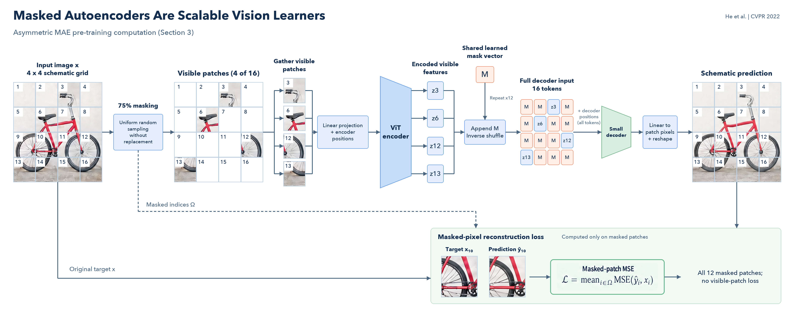

# MAE: A Paper-to-Figure Example

**English** · [简体中文](README.zh-CN.md)

**Paper:** Kaiming He, Xinlei Chen, Saining Xie, Yanghao Li, Piotr Dollar, and Ross Girshick. *Masked Autoencoders Are Scalable Vision Learners*. CVPR 2022, pp. 16000-16009. [Official proceedings](https://openaccess.thecvf.com/content/CVPR2022/html/He_Masked_Autoencoders_Are_Scalable_Vision_Learners_CVPR_2022_paper.html) · [Paper PDF](https://openaccess.thecvf.com/content/CVPR2022/papers/He_Masked_Autoencoders_Are_Scalable_Vision_Learners_CVPR_2022_paper.pdf)

The application read **Section 3, Approach**, directly from the official PDF. The illustration follows the paper's asymmetric pre-training computation: only visible patches enter the encoder; shared mask tokens are added afterward; the decoder predicts pixels; reconstruction loss uses masked locations only.

## Read the Figure

- **Image patches carry content.** The same red bicycle appears before masking, in the retained crops, and in the schematic prediction.
- **The encoder input is sparse.** Four of sixteen patches remain in this schematic 75% mask.
- **Features are not image crops.** The encoder outputs labeled representations `z3`, `z6`, `z12`, and `z13`.
- **One mask vector is shared.** Twelve copies of `M` fill missing positions before decoder positional embeddings are added to every token.
- **Supervision has an explicit path.** Original targets and predicted pixels meet at masked-patch MSE, with no loss on visible patches.

The bicycle and 4 × 4 layout are original drawing choices for explaining the method. They are not benchmark reconstruction results or copied paper artwork.

## Generate It Through the Workbench

1. Download the official PDF linked above, create a project, and upload the paper.
2. Select **3. Approach**. In the recorded parser output this is zero-based section index `11`, spanning PDF pages 3-4; the full section fits the context budget.
3. Choose **Pastel**, **Quality**, **ML TopConf (Seaborn Deep)**, **Overall framework**, and one figure. Use the requirements in [request.json](mae/request.json).
4. Generate and review the prompt and source-linked FigureSpec. This run's second revision aligns the canvas instruction with **3840 × 2160, 16:9**; the scientific structure is unchanged.
5. Generate at **4K**, **16:9**, **Quality**, then inspect the result.
6. This example made two reference-image edits, the second with a connector mask. The [first instruction](mae/edit-instruction.txt), [masked-edit instruction](mae/connector-instruction.txt), and [initial PNG](mae/initial.png) are included.
7. Run `uv run --project backend --locked python docs/demo/layout_mae.py` from the repository root to compose the saved artwork at **4800 × 1920, 5:2**. This example-specific script reuses the generated bicycle patches and places modules, labels, and connector endpoints locally.

For the shortest route, paste [prompt.txt](mae/prompt.txt) into Direct generation with the same palette, style, and size. The layout can vary between generations.

## Generation Record

| Stage | Recorded configuration |
| --- | --- |
| Source | Official CVPR 2022 PDF, Section 3, full selected-section coverage |
| Prompt | `gpt-6-astra`, reasoning `max`, Standard processing |
| Structure | 18 nodes and 19 edges, reviewed against the paper |
| Image | `gpt-image-2.5-sunburst`, quality `max`, 3840 × 2160 |
| Rendering | Pastel, ML TopConf Deep palette, text-to-image |
| Refinement | Two Image API edits; the second uses an edit mask |
| Final layout | Local 5:2 composition, 4800 × 1920, without another generation call |

Exact durations, token usage, and the saved prompt revision are in [manifest.json](mae/manifest.json). The backend appends its rendering direction and semantic palette to the reviewed drawing prompt before the Image API call.

## Files

| File | Contents |
| --- | --- |
| [method-notes.txt](mae/method-notes.txt) | Short method summary used in the animation |
| [request.json](mae/request.json) | Actual figure-generation requirements |
| [prompt.txt](mae/prompt.txt) | Reviewed English drawing prompt |
| [image-prompt.txt](mae/image-prompt.txt) | Complete prompt sent to the Image API |
| [edit-prompt.txt](mae/edit-prompt.txt) | Complete prompt used for the reference-image refinement |
| [connector-prompt.txt](mae/connector-prompt.txt) | Complete prompt used for the masked edit |
| [refined.png](mae/refined.png), [repair-base.png](mae/repair-base.png) | Saved Image API edit outputs used as artwork sources |
| [layout_mae.py](../../docs/demo/layout_mae.py) | Reproducible wide layout and port-attached connectors |
| [figure-spec.json](mae/figure-spec.json) | Semantic graph, with verbatim paper excerpts omitted from the public copy |
| [manifest.json](mae/manifest.json) | Paper reference, source-section mapping, actual settings, duration, and usage |
| [visual-contract.md](mae/visual-contract.md) | Scientific topology and composition decisions |
| [figure.png](mae/figure.png) | Finished 4800 × 1920 PNG |

The local workbench retains the uploaded PDF and exact source quotes. The public FigureSpec is a semantic graph, not a vector reconstruction of the PNG.

Animation source and build instructions: [docs/demo](../../docs/demo/README.md).
