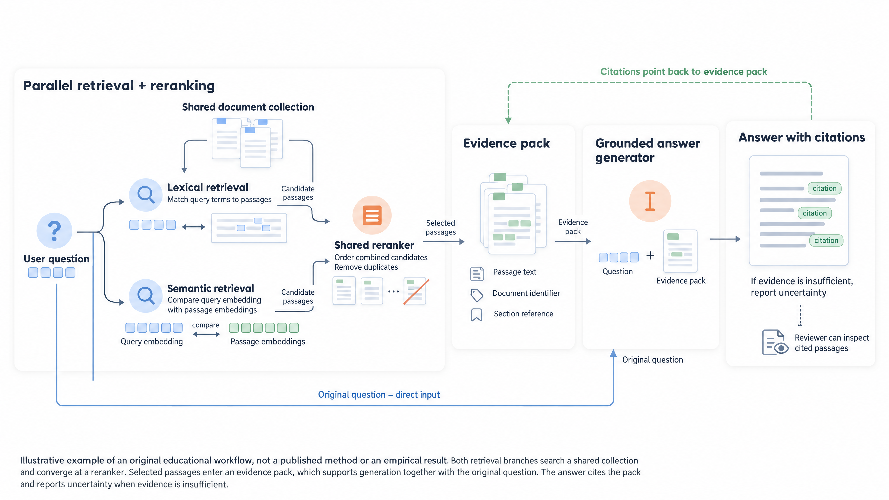

# 证据优先检索

[English](README.md) · **简体中文**

这个原创教学示例展示：问题进入词法与语义双路检索，经共享重排序器形成证据包，最终生成带引用的回答。原始文本是为本项目演示编写的一份简短说明。

## 如何生成类似配图

1. 启动应用，新建项目，上传 [input.txt](retrieval/input.txt)。
2. 选中文档及全部章节，选择 **Pastel、Quality、ML TopConf (Seaborn Deep)、整体框架图**，数量设为一张。
3. 将 [request.json](retrieval/request.json) 中的 `user_request` 粘贴到需求框，生成提示词。
4. 审阅英文提示词和带原文引用的 FigureSpec。本例直接使用第一版提示词，没有手动修改。
5. 选择 **16:9、4K、Quality**，生成并下载 PNG。

也可以把 [prompt.txt](retrieval/prompt.txt) 粘贴到“直接生成”，选择同样的风格、配色和图片参数。重新生成时，布局与细节可能有所不同。

## 这张图的生成记录

| 阶段 | 实际设置 | 耗时 |
| --- | --- | --- |
| 原文选择 | 四个章节，完整覆盖 | 本地解析 |
| 提示词 | `gpt-6-astra`，推理 `max`，Standard 处理 | 374.517 秒 |
| 构图规则 | Pastel Skill、自定义需求、ML TopConf Deep 配色 | 包含在提示词生成中 |
| 图片 | `gpt-image-2.5-sunburst`，画质 `max`，3840 × 2160 | 73.450 秒 |

文本模型生成了 13,245 字符的绘图提示词，以及含九个节点、十二条连接的 FigureSpec。后端追加统一的渲染要求和精确配色，再将完整提示词发送给 Image API。这张 PNG 是首次文生图结果，没有使用参考图或蒙版。

## 文件

| 文件 | 内容 |
| --- | --- |
| [input.txt](retrieval/input.txt) | 完整原始文本 |
| [request.json](retrieval/request.json) | 配图要求和风格选择 |
| [prompt.txt](retrieval/prompt.txt) | 文本模型生成的英文绘图提示词 |
| [image-prompt.txt](retrieval/image-prompt.txt) | 包含后端渲染要求的完整 Image API 提示词 |
| [figure-spec.json](retrieval/figure-spec.json) | 语义图结构和原文引用 |
| [manifest.json](retrieval/manifest.json) | 模型、画质、尺寸、耗时和 Token 用量 |
| [figure.png](retrieval/figure.png) | 原始 3840 × 2160 PNG |

FigureSpec 与图片是两个独立输出。投稿前应检查图片的连线；本例的语料连接和一小段多余蓝线仍需调整。这里保留原始文件，便于对照生成记录。

动图源码与构建方法：[docs/demo](../../docs/demo/README.md)。
